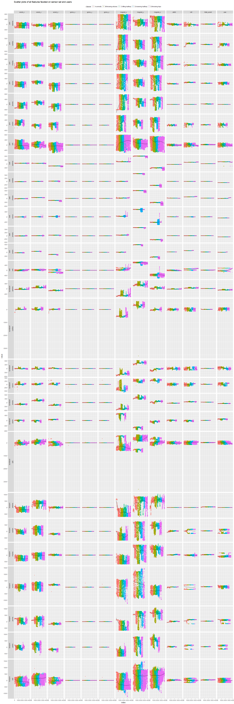
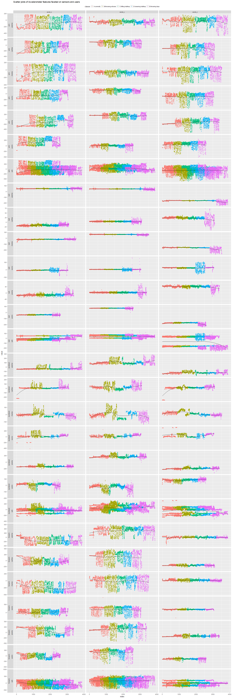
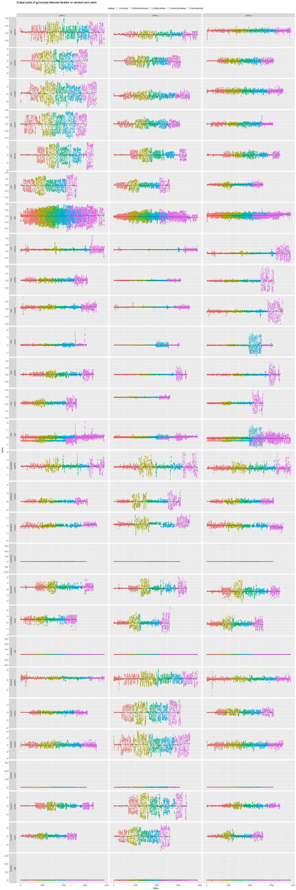
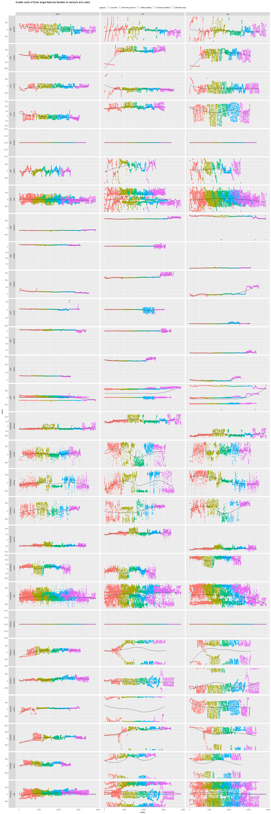

Human Activity Recognition - Weight Lifting Exploratory Data Analysis
================
Maurício Collaça
December 5, 2017

Six young health participants were asked to perform one set of 10 repetitions of the Unilateral Dumbbell Biceps Curl in five different fashions: exactly according to the specification (Class A), throwing the elbows to the front (Class B), lifting the dumbbell only halfway (Class C), lowering the dumbbell only halfway (Class D) and throwing the hips to the front (Class E).

Read more: <http://groupware.les.inf.puc-rio.br/har#weight_lifting_exercises>

Data validation and transformation
----------------------------------

The training set row and columns dimensions

    ## [1] 19622   160

The testing set row and columns dimensions

    ## [1]  20 160

### Total readings by classification and user

            adelmo carlitos charles eurico jeremy pedro (total)
    A         1165      834     899    865   1177   640    5580
    B          776      690     745    592    489   505    3797
    C          750      493     539    489    652   499    3422
    D          515      486     642    582    522   469    3216
    E          686      609     711    542    562   497    3607
    (total)   3892     3112    3536   3070   3402  2610   19622

### Total windows and average readings per user and classe

| user\_name | classe |  total\_windows|  average\_readings|
|:-----------|:-------|---------------:|------------------:|
| adelmo     | A      |              53|                 22|
| adelmo     | B      |              35|                 22|
| adelmo     | C      |              34|                 22|
| adelmo     | D      |              24|                 21|
| adelmo     | E      |              31|                 22|
| carlitos   | A      |              34|                 25|
| carlitos   | B      |              31|                 22|
| carlitos   | C      |              20|                 25|
| carlitos   | D      |              20|                 24|
| carlitos   | E      |              25|                 24|
| charles    | A      |              41|                 22|
| charles    | B      |              33|                 23|
| charles    | C      |              24|                 22|
| charles    | D      |              30|                 21|
| charles    | E      |              30|                 24|
| eurico     | A      |              37|                 23|
| eurico     | B      |              24|                 25|
| eurico     | C      |              22|                 22|
| eurico     | D      |              24|                 24|
| eurico     | E      |              23|                 24|
| jeremy     | A      |              48|                 25|
| jeremy     | B      |              22|                 22|
| jeremy     | C      |              28|                 23|
| jeremy     | D      |              23|                 23|
| jeremy     | E      |              25|                 22|
| pedro      | A      |              29|                 22|
| pedro      | B      |              23|                 22|
| pedro      | C      |              23|                 22|
| pedro      | D      |              20|                 23|
| pedro      | E      |              22|                 23|

### Missing values: NA, "\#DIV/0!" or ""

100 training variables have either 98% or 100% missing values.


       0 0.98    1 
      60   94    6 

100 testing variables have 100% missing values.

    testNAproportion
      0   1 
     60 100 

By visually inspecting the dataset it was found the missing values are due to statistics calculated in time windows and stored at rows whose new\_window = "yes", characterizing a messy data set where rows are not allways representing a single observation. As those statistics can be recalculated from the raw data, they will be disregarded.

The new training and test set row and columns dimensions

    ## [1] 19622    57

    ## [1] 20 57

Exploratory Data Analysis
-------------------------

### [Heatmaps](HAR-WLE-heatmaps)

### [Generalized pairs plots](HAR-WLE-heatmaps)

### Faceted scatter plots

#### TODO: What are the accelerometer, gyroscope and magnetometer units?

#### TODO: What are the pitch, roll, yaw and total\_accel units?

#### All features by sensor set and users

``` r
prepareFacet <- function(data, groups, features, color, lhsName, lhsPattern, lhsReplacement, rhsName, rhsPattern, rhsReplacement) {
    data %>%
        select(matches(groups), matches(features), matches(color)) %>%
        mutate_at(vars(matches(groups)), factor) %>%
        mutate_at(vars(matches(color)), factor) %>%
        gather(key="feature", value = "value", -matches(groups), -matches(color), factor_key = TRUE) %>%
        mutate(!!lhsName := factor(sub(lhsPattern, lhsReplacement, feature)),
               !!rhsName := factor(sub(rhsPattern, rhsReplacement, feature)),
               feature = NULL) %>%
        group_by_at(vars(matches(groups), lhsName, rhsName)) %>% mutate(index=row_number()) %>% ungroup() %>%
        select(matches(groups), lhsName, rhsName, value, index, matches(color)) # %>% arrange() %>% ???
}
```



#### Accelerometer features by sensors and users



#### Gyroscope features by sensors and users



#### Euler angle features by sensors and users


