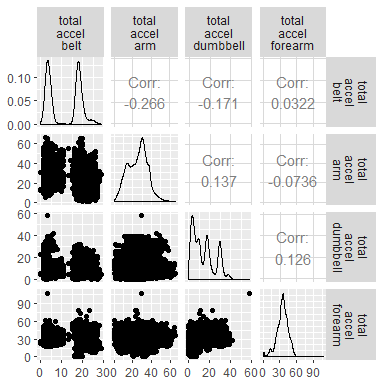
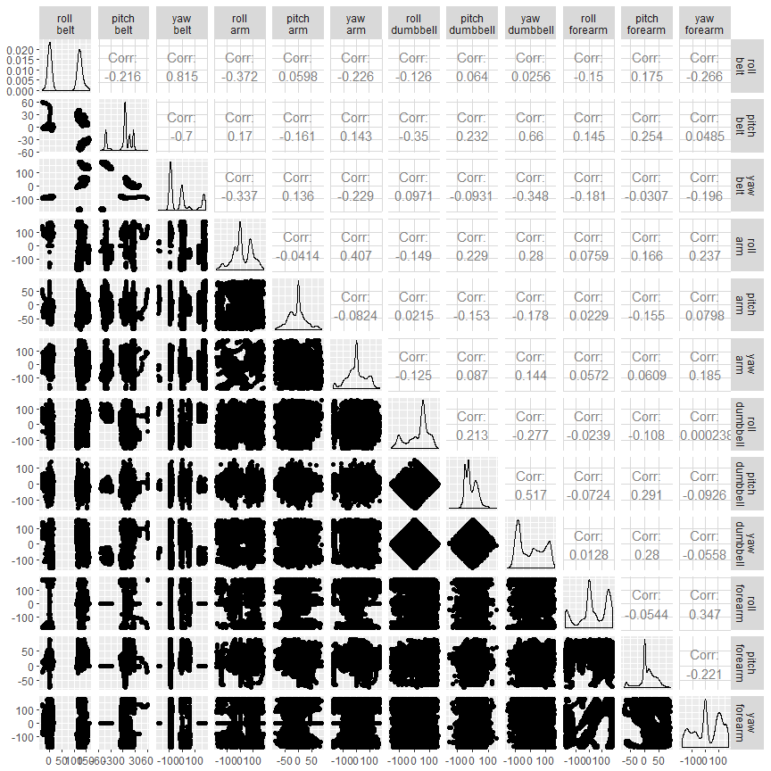
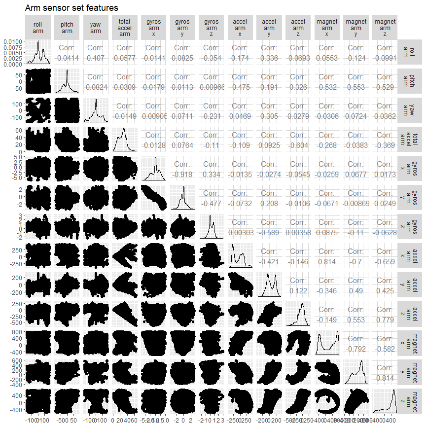
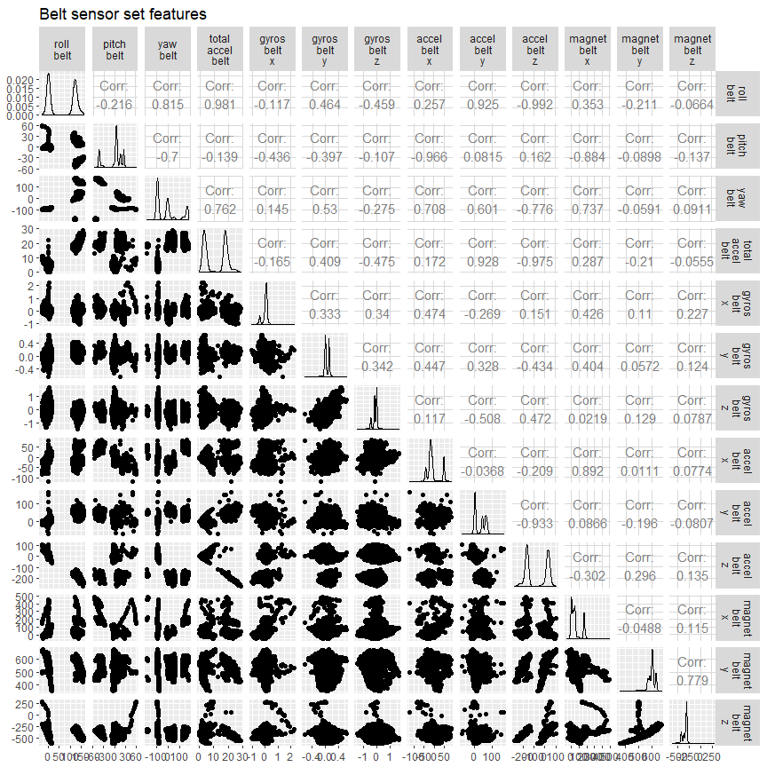
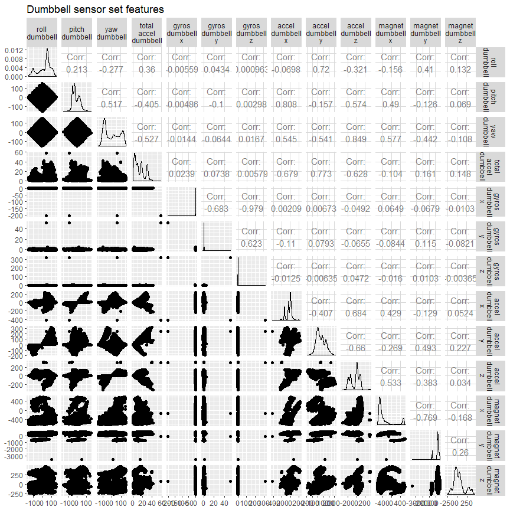
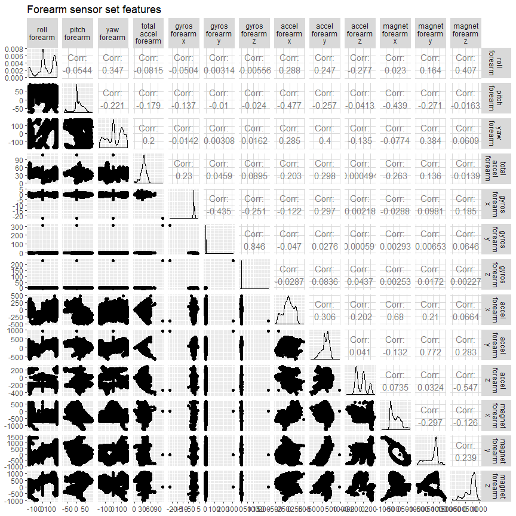
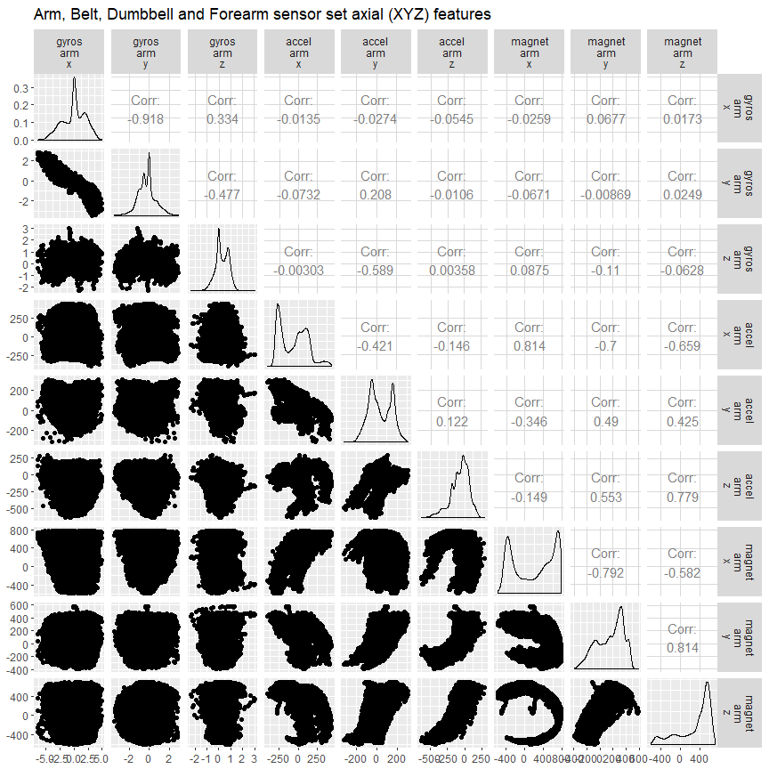
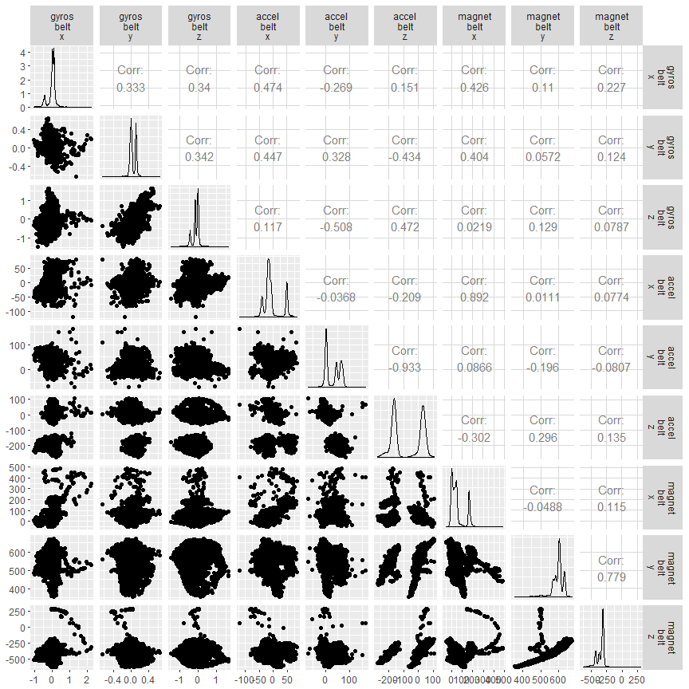
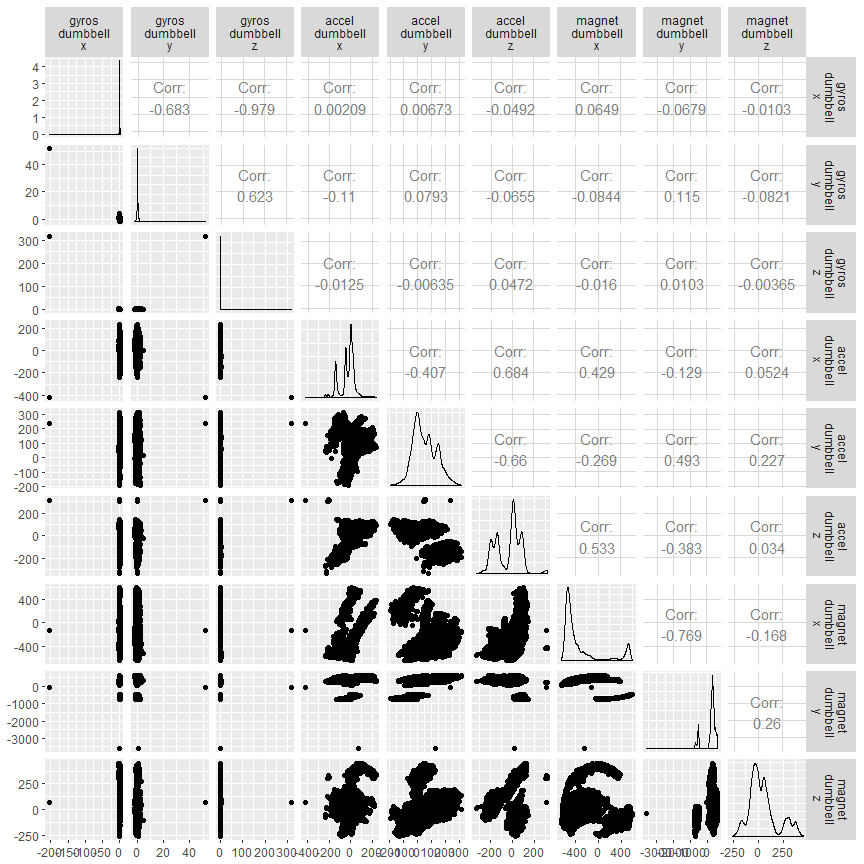
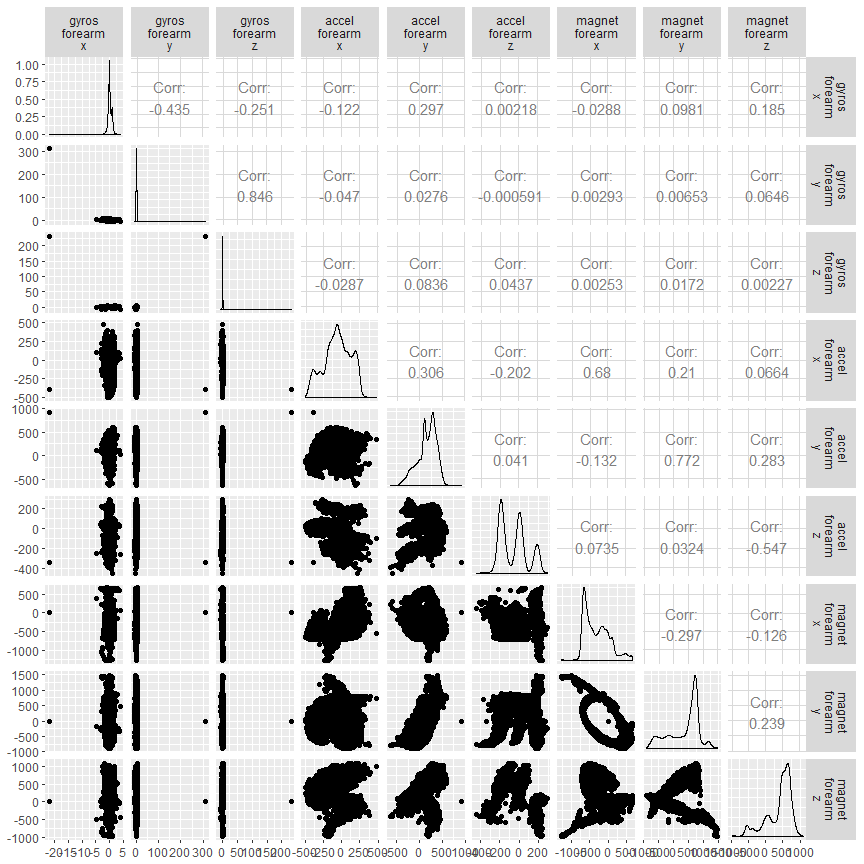

WLE Heatmaps
================
Maurício Collaça
December 5, 2017

### Heatmaps

### Generalized pairs plots

##### Accelerometer totals by sensor set

#### Euler angles (pitch, roll and yaw) from sensors (belt, arm, dumbell and Forearm)

#### Arm sensor set

#### Belt sensor set

#### Dumbbell sensor set

#### Forearm sensor set

#### Axial signals

##### Arm axial signals

##### Belt axial signals

##### Dumbbell axial signals

##### Forearm axial signals

