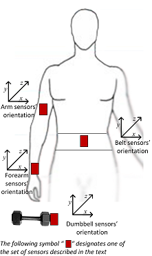

```{r setup, include=FALSE}
knitr::opts_chunk$set(echo = TRUE)
```

## Summary

Six participants using sensors on the belt, forearm, arm and a dumbbell were asked to perform one set of 10 repetitions of the unilateral dumbbell biceps curl in five different fashions: exactly according to the specification (Class A), throwing the elbows to the front (Class B), lifting the dumbbell only halfway (Class C), lowering the dumbbell only halfway (Class D) and throwing the hips to the front (Class E). This experiment results a dataset.

<center></center>

More information about this experiment [here](http://groupware.les.inf.puc-rio.br/har#weight_lifting_exercises).

The goal is to train a machine learning model using [training data](https://d396qusza40orc.cloudfront.net/predmachlearn/pml-training.csv) to predict the manner in which 20 [testing cases](https://d396qusza40orc.cloudfront.net/predmachlearn/pml-testing.csv) did the exercise.

The required model accuracy to correctly predict all 20 tests with 95% confidence is `r round(0.95^(1/20),4)`.  The estimated model accuracy is 0.9931. The estimated out-of-sample error is 0.0069.

## Data validation and transformation

Required libraries:
```{r libraries, message=FALSE, warning=FALSE, include=FALSE}
library(dplyr); library(tidyr); library(ggplot2); library(GGally); library(caret)
```
```{r, ref.label="libraries", eval=FALSE}
```

Reading data with three types of missing values "NA", "" and "#DIV/0!".
```{r}
training <- read.csv("pml-training.csv", na.strings=c("NA","","#DIV/0!"))
testing <- read.csv("pml-testing.csv", na.strings=c("NA","","#DIV/0!"))
```

The training set has `r nrow(training)` rows and `r ncol(training)` columns.  The testing set has `r nrow(testing)` rows and `r ncol(testing)` columns.  This is a multi-variate time-series dataset where each observation is indentified by the variable `X`.  Each observation belongs to a specific user name and exercise class, occurring one series of time windows, second and miliseconds. They hold variables containing raw data and summary statistics from the four sensors. The time-series observations are grouped by `classe`:
```{r grouping, fig.height=2, fig.width=10}
ggplot(training, aes(x=1:nrow(training), y=X, color=classe)) + geom_point() + xlab("rows")
```

This contingency table shows training data reasonably distributed across users and classe:
```{r comment=""}
with(training, rbind(cbind(table(user_name, classe), "(total)" = table(user_name)),
                     "(total)" = c(table(classe), length(classe)))) %>% knitr::kable()
```

100 training variables have high incidence of missing values.
```{r comment=""}
NA.proportion <- function(x) mean(is.na(x))
table(NA.proportion=round(sapply(training, NA.proportion),2))
```

100 testing variables have 100% missing values.
```{r comment=""}
table(NA.proportion=sapply(testing, NA.proportion))
```

Those missing values are due to statistics calculated in time windows recorded at rows whose column `new_window` = "yes", characterizing a messy data set where rows are not always representing a single observation.

As the prediction model is being developed for the specific 20 testing cases, it should only hold predictors with actual data on both training and testing sets, therefore, variables with missing data will be dropped.

```{r}
missedTrainVars <- names(which(sapply(training, function(x) any(is.na(x)))))
missedTestVars <- names(which(sapply(testing, function(x) any(is.na(x)))))
missedVars <- unique(c(missedTrainVars, missedTestVars))
training <- select(training, -one_of(missedVars))
```

Training observations of a given user and classe are grouped in time windows of 1 second, therefore the average readings per window or per second are the same:
```{r comment=""}
group_by(training, user_name, classe) %>%
    summarise(readings_per_second=n()/n_distinct(num_window)) %>%
    select(user_name, classe, readings_per_second) %>% spread(classe, readings_per_second) %>%
    knitr::kable(col.names = gsub("_"," ",names(.)))
```

Testing data contains only one observation per time window.
```{r comment=""}
with(testing, rbind(table(num_window, user_name), "(total)" = table(user_name)))
```

Therefore, it's assumed the machine learning model wouldn't predict on time-related variables and so they are dropped.
```{r}
select(training, matches("window|timestamp")) %>% names()
training <- select(training, -matches("window|timestamp"))
```

The row identification variable `X` has no purpose in the training model and so it is dropped.
```{r}
training$X <- NULL
```

As both training and testings set contain the variable `user_name`, it will be leveraged in the model for user-refined predictions.

The new training set has `r nrow(training)` rows and `r ncol(training)` columns.

## Exploratory Data Analysis

The following plot matrix shows feature patterns accross the 5 classes, faceting on the 4 sensor sets. It must be zoomed to 200% for proper viewing.

```{r allFeatureBoxplot, echo=FALSE, fig.height=10, fig.width=20, cache=TRUE}
prepareFacet <- function(data, groups, features, color, lhsName, lhsPattern, lhsReplacement, rhsName, rhsPattern, rhsReplacement) {
    data %>%
        select(matches(groups), matches(features), matches(color)) %>%
        mutate_at(vars(matches(groups)), factor) %>%
        mutate_at(vars(matches(color)), factor) %>%
        gather(key="feature", value = "value", -matches(groups), -matches(color), factor_key = TRUE) %>%
        mutate(!!lhsName := factor(sub(lhsPattern, lhsReplacement, feature)),
               !!rhsName := factor(sub(rhsPattern, rhsReplacement, feature)),
               feature = NULL) %>%
        group_by_at(vars(matches(groups), lhsName, rhsName)) %>% mutate(index=row_number()) %>% ungroup() %>%
        select(matches(groups), lhsName, rhsName, value, index, matches(color))
}
data <- prepareFacet(data = training,
                     groups = "user_name",
                     color = "classe",
                     features = "(_arm|_belt|_dumbbell|_forearm)",
                     lhsName = "sensor_set",
                     lhsPattern = "^.+_(arm|belt|dumbbell|forearm)_?.*$",
                     lhsReplacement = "\\1",
                     rhsName = "signal",
                     rhsPattern = "^(.+)_(arm|belt|dumbbell|forearm)(_?)(.*)$",
                     rhsReplacement = "\\1\\3\\4")
levels(data$classe) <- c("A)correctly", "B)throwing elbows", "C)lifting halfway", "D)lowering halfway", "E)throwing hips")
ggplot(data, aes(x=classe, y=value, fill=classe)) + theme_bw() +
    theme(legend.position = "top", axis.text.x=element_blank(), axis.ticks.x=element_blank()) +
    ggtitle("Boxplots of all features faceted on sensor set") +
    facet_grid(sensor_set ~ signal,
               margins=FALSE, scales="free", space="free", shrink=TRUE, switch="y") +
    geom_boxplot()
```

One can see the gyroscope-related features show the smallest range followed by the total acceleration and the pitch features.  There are many outliers such as in magnetometer features with oustanding ones specifically in the magnet_dumbbell_feature.

It's assumed that the Random Forest alghorithm will not be much influenced by outliers so their treatment is out of the scope of this project.

## Model development

```{r include=FALSE}
(estimatedAccuracy <- 0.95^(1/20))
```
The estimated model accuracy to correctly predict all 20 tests with 95% confidence is $0.95 ^ \left(\frac{1}{20}\right)$ which is `r estimatedAccuracy`.  Consequently, the expected error rate is `r 1-estimatedAccuracy`.

Cross-validation will be used to prevent overfitting and to find more precise estimates of accuracy and out-of-sample error, therefore, the former training data is partitioned in two sets model training and probing.  Assuming it's a medium sample size and as per suggested by the specialization course, the split is 60% for training and 40% for probing.  A constant random number generator seed is always set to ensure reproducibility.

```{r}
set.seed(1)
inTraining <- createDataPartition(training$classe, p = .60, list = FALSE)
training <- training[ inTraining,]
probing  <- training[-inTraining,]
```

The prediction algorithm to be used is the Breiman's random forest from the r package `randomForest` version `r packageVersion("randomForest")`.  One advantage is the accuracy and disadvantages are on speed, interpretability and overfitting. Its tunning parameter `mtry` sets the number of variables randomly sampled as candidates at each tree split. As the outcome `classe` is a categorical value, that's a classification task whose default is the maximum integer lower than the square root of the number of predictors. Its tunning parameter `ntree` sets the number of trees to grow during the execution whose default is 500.

The training speed is improved through parallel processing, allowing multiple executions of the random forest at same time according to the number of CPU cores.
```{r message=FALSE, comment=""}
library(parallel); library(doParallel)
cluster <- makeCluster(detectCores())
registerDoParallel(cluster)
cluster
```

For this dataset, the default tunning parameter `mtry` is:
```{r}
floor(sqrt(ncol(training) - 1))
```

However, the `randomForest` package makes available the function `tuneRF()` to tune for the optimal `mtry` parameter with respect to Out-of-Bag error estimate.  This function is employed in a simulation to also estimate the optimal `ntree` parameter:
```{r tuneRF, cache=TRUE}
tuneRFGrid <- expand.grid(stepFactor = 1.5, improve = 0.001, ntreeTry = c(50, 250, 500, 750, 1000))
clusterExport(cluster, "training")
ptm <- proc.time()
tunes <- parApply(cluster, tuneRFGrid, 1, function(param) {
    set.seed(1)
    ptm <- proc.time()
    tune <- randomForest::tuneRF(x=training[,-ncol(training)], y=training$classe, trace=FALSE, plot = FALSE,
                   stepFactor=param["stepFactor"], improve=param["improve"], ntreeTry=param["ntreeTry"])
    c(tune[which.min(tune[,2]),], (proc.time()-ptm)[3])
})
proc.time() - ptm
tunes <- bind_cols(tuneRFGrid, as.data.frame(t(tunes)))
knitr::kable(tunes)
```

The optimal `mtry` and `ntree` parameters have the minimum out-of-bag error.
```{r, comment=""}
(mtry <- tunes$mtry[which.min(tunes$OOBError)])
(ntree <- tunes$ntreeTry[which.min(tunes$OOBError)])
```

Cross-validation is also used to train different models with different resamples and tunning parameters in order to minimize the prediction bias, calculate a resampling based average accuracy and find the optimal model.  Through the meta-package `caret` version `r packageVersion("caret")`, a k-fold cross-validation is performed with default 10 fold resampling to fit random forest models with different a grid of tunning parameters set from the range of the default and the optimal `mtry` parameter, considering the optimal `ntree` parameter.

The tune grid:
```{r, comment=""}
tuneRange <- range(floor(sqrt(ncol(training) - 1)), tunes$mtry[which.min(tunes$OOBError)])
tuneGrid <- data.frame(mtry = min(tuneRange):max(tuneRange))
tuneGrid$mtry
```

The 10 k-fold cross-validated random forest model training using the tune grid:
```{r fit, cache=TRUE, comment=""}
set.seed(1)
ptm <- proc.time()
fit <- train(classe ~ ., training, method = "rf", tuneGrid = tuneGrid, ntree=ntree, 
             trControl = trainControl(method = "cv", number = 10, search = "grid"))
proc.time() - ptm
```

Disable paralell processing
```{r}
stopCluster(cluster)
registerDoSEQ()
```

The training summary shows the accuracy of the best model resulted from 10 k-fold cross-validation and the final `mtry` parameter.
```{r, comment=""}
fit
```

The confusion matrix estimated from the training resamples:
```{r, comment=""}
confusionMatrix.train(fit)
```

On the training data, the expected out of sample error is:
```{r}
(expectedError <- (1 - fit$results$Accuracy[which.max(fit$results$Accuracy)]))
```

Predicting on the probing set.
```{r}
probePredict <- predict(fit, probing)
```

The confusion matrix calculated from the probing set suggests that the expected out of sample error could be even closer to zero when doing the final testing.
```{r, comment=""}
confusionMatrix(probePredict, probing$classe)
```

## Prediction of 20 test cases

The prediction model is used to predict 20 test cases required from the quiz.

```{r}
cbind(testing[, c("user_name","problem_id")],  prediction=predict(fit, testing)) %>% knitr::kable()
```

## References

Velloso, E.; Bulling, A.; Gellersen, H.; Ugulino, W.; Fuks, H. Qualitative Activity Recognition of Weight Lifting Exercises. Proceedings of 4th International Conference in Cooperation with SIGCHI (Augmented Human '13) . Stuttgart, Germany: ACM SIGCHI, 2013.

